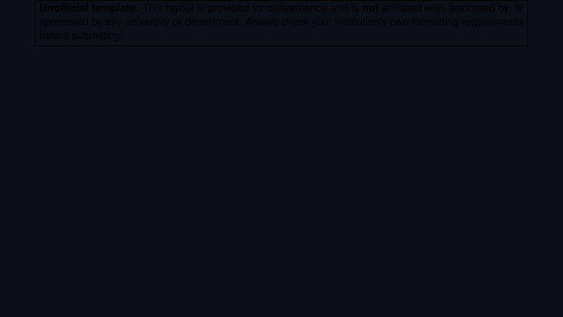

# Three Minute Thesis (3MT) Slide LaTeX Template

[](https://letx.app/templates/presentations/three-minute-thesis-slides/)
[](LICENSE)

A single-slide Three Minute Thesis (3MT) layout in 16:9 Beamer, marked on the slide itself as unaffiliated with any university, with a title and one striking visual.

Edit and compile it in your browser at **[letx.app](https://letx.app/templates/presentations/three-minute-thesis-slides/)**, with no LaTeX install and real-time collaboration. A compile takes a few seconds.



## What is in it
- Document class: `beamer` with `aspectratio=169, 11pt`
- Compiler: pdflatex
- One self-contained `main.tex`

## Use it online
Open **[Three Minute Thesis (3MT) Slide on LetX](https://letx.app/templates/presentations/three-minute-thesis-slides/)** and click *Open as Template*. It is free.

## <a name="compile"></a>Compile locally
```bash
git clone https://github.com/Shahriar-Labs/latex-templates.git
cd latex-templates/presentations/three-minute-thesis-slides
latexmk -pdf main.tex
```

## About
Part of the free, open-source [LetX template library](https://letx.app/templates/): presentation templates for students, researchers and professionals. Built by [Shahriar Labs](https://shahriarlabs.com).

## License
MIT. See [LICENSE](LICENSE).
