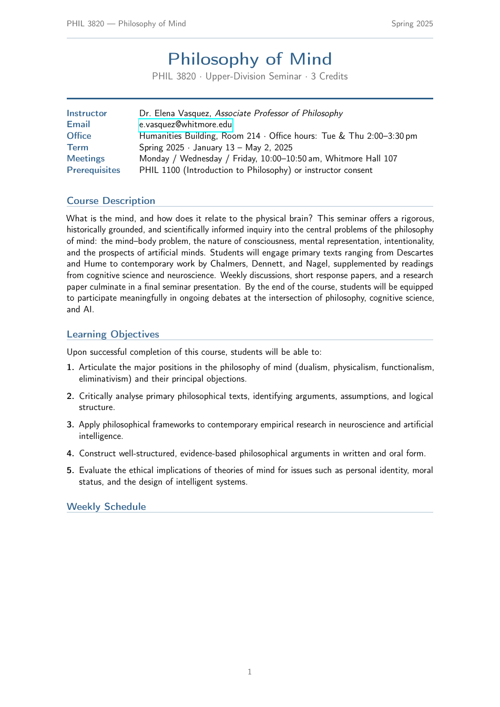

# Course Syllabus — Free LaTeX Template

[](https://letx.app/templates/assignments/reading-list-syllabus)
[](LICENSE)
[](#compile)

**University course syllabus & reading list LaTeX template — course info box, description, learning objectives, a weekly schedule table, grading breakdown, policies and a grouped reading list.**

Edit and compile this template instantly in your browser — no LaTeX install — at **[letx.app](https://letx.app/templates/assignments/reading-list-syllabus)**, with real-time collaboration and one-second compiles.



## Features
- Course info box + description
- Learning objectives
- Weekly schedule table (booktabs)
- Grading breakdown + policies
- Grouped required/recommended reading list

## Use it online (recommended)
Open **[Course Syllabus on LetX »](https://letx.app/templates/assignments/reading-list-syllabus)** and click *Open as Template* — it compiles in ~1 second, in your browser, free.

## <a name="compile"></a>Compile locally
```bash
git clone https://github.com/Shahriar-Labs/latex-templates.git
cd latex-templates/reading-list-syllabus
latexmk -pdf main.tex
```
Compiler: **pdflatex** (see `metadata.json`).

## About
Part of the free, open-source [LetX template library](https://letx.app/templates) — assignment templates for students, researchers, and professionals. Built by [Shahriar Labs](https://shahriarlabs.com).

## License
MIT — free for personal and commercial use. See [LICENSE](LICENSE).
