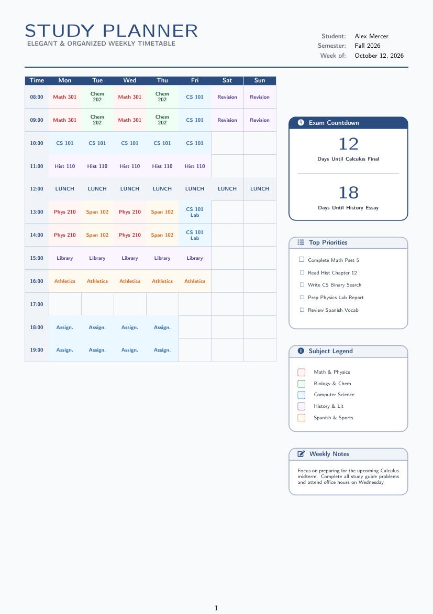

# Study Planner — Free LaTeX Template

[](https://letx.app/templates/calendars/study-planner)
[](LICENSE)
[](#compile)

**Weekly study planner LaTeX template — a subject timetable grid, exam-countdown box, top-priorities checklist, subject color legend and a weekly-notes panel. Elegant, one-page, printable.**

Edit and compile this template instantly in your browser — no LaTeX install — at **[letx.app](https://letx.app/templates/calendars/study-planner)**, with real-time collaboration and one-second compiles.



## Features
- Weekly subject timetable grid (Mon-Sun)
- Exam-countdown highlight box
- Top-priorities checklist + subject legend
- Weekly notes panel
- Modern one-page printable design

## Use it online (recommended)
Open **[Study Planner on LetX »](https://letx.app/templates/calendars/study-planner)** and click *Open as Template* — it compiles in ~1 second, in your browser, free.

## <a name="compile"></a>Compile locally
```bash
git clone https://github.com/Shahriar-Labs/latex-templates.git
cd latex-templates/study-planner
latexmk -pdf main.tex
```
Compiler: **pdflatex** (see `metadata.json`).

## About
Part of the free, open-source [LetX template library](https://letx.app/templates) — calendar and planner templates for students, researchers, and professionals. Built by [Shahriar Labs](https://shahriarlabs.com).

## License
MIT — free for personal and commercial use. See [LICENSE](LICENSE).
