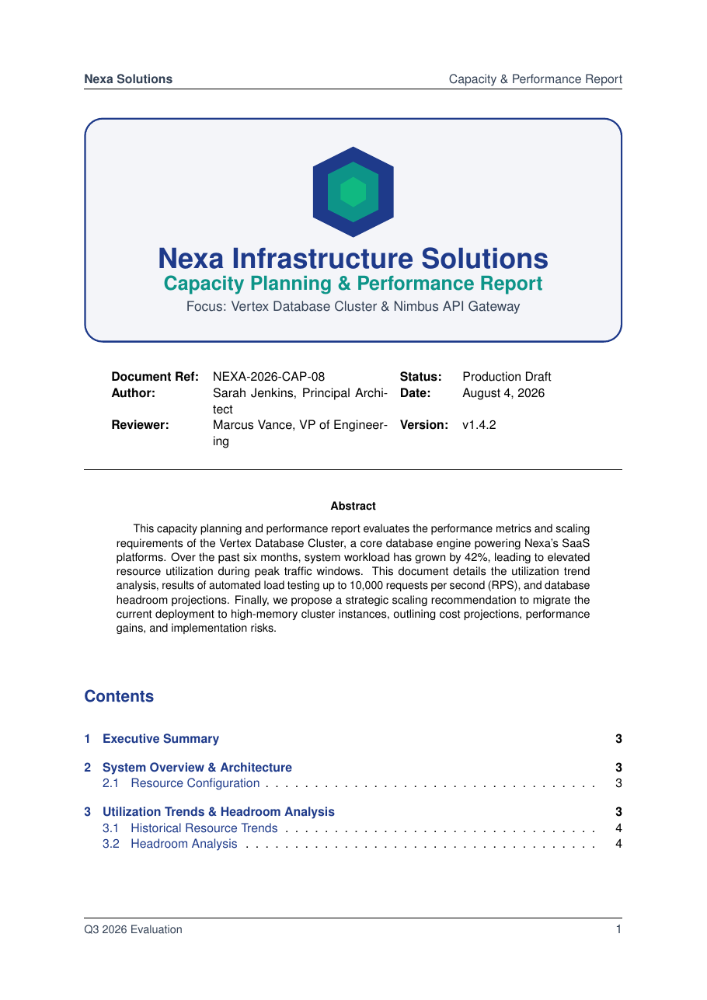

# Capacity Planning and Performance Report LaTeX Template

[](https://letx.app/templates/tech-docs/capacity-planning-and-performance-report/)
[](LICENSE)

A capacity planning and performance report with the system overview, utilization trends and headroom, load testing limits in pgfplots, and recommendations with cost impact.

Edit and compile it in your browser at **[letx.app](https://letx.app/templates/tech-docs/capacity-planning-and-performance-report/)**, with no LaTeX install and real-time collaboration. A compile takes a few seconds.



## What is in it
- Document class: `article` with `11pt, a4paper`
- Compiler: pdflatex
- Files: `main.tex`, `preamble.tex`, `references.bib`, and 5 section files under `sections/`

## Use it online
Open **[Capacity Planning and Performance Report on LetX](https://letx.app/templates/tech-docs/capacity-planning-and-performance-report/)** and click *Open as Template*. It is free.

## <a name="compile"></a>Compile locally
```bash
git clone https://github.com/Shahriar-Labs/latex-templates.git
cd latex-templates/tech-docs/capacity-planning-and-performance-report
latexmk -pdf main.tex
```

## About
Part of the free, open-source [LetX template library](https://letx.app/templates/): technical documentation templates for students, researchers and professionals. Built by [Shahriar Labs](https://shahriarlabs.com).

## License
MIT. See [LICENSE](LICENSE).
