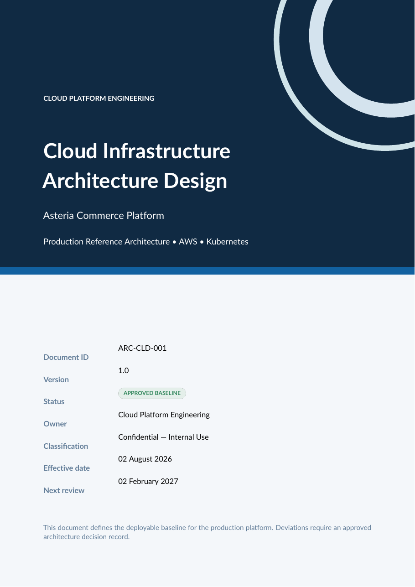

# Cloud Infrastructure Architecture Design Document LaTeX Template

[](https://letx.app/templates/tech-docs/cloud-infrastructure-architecture-design-document/)
[](LICENSE)

A cloud infrastructure architecture design document in Lato with document control, requirements, target architecture, network, compute, data, and security architecture, in twenty-nine tables.

Edit and compile it in your browser at **[letx.app](https://letx.app/templates/tech-docs/cloud-infrastructure-architecture-design-document/)**, with no LaTeX install and real-time collaboration. A compile takes a few seconds.



## What is in it
- Document class: `article` with `11pt, a4paper`
- Compiler: pdflatex
- Files: `main.tex`, `preamble.tex`, and 19 section files under `sections/`

## Use it online
Open **[Cloud Infrastructure Architecture Design Document on LetX](https://letx.app/templates/tech-docs/cloud-infrastructure-architecture-design-document/)** and click *Open as Template*. It is free.

## <a name="compile"></a>Compile locally
```bash
git clone https://github.com/Shahriar-Labs/latex-templates.git
cd latex-templates/tech-docs/cloud-infrastructure-architecture-design-document
latexmk -pdf main.tex
```

## About
Part of the free, open-source [LetX template library](https://letx.app/templates/): technical documentation templates for students, researchers and professionals. Built by [Shahriar Labs](https://shahriarlabs.com).

## License
MIT. See [LICENSE](LICENSE).
