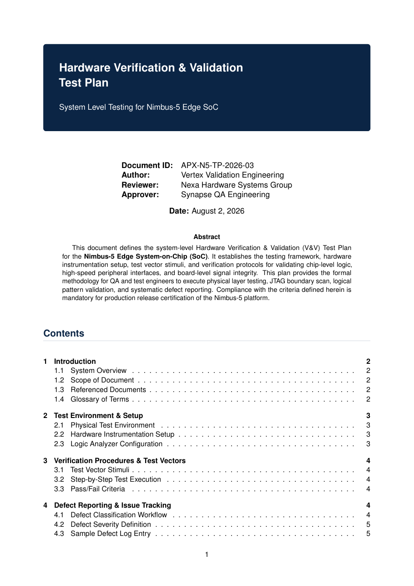

# Hardware Verification & Validation Test Plan LaTeX Template

[](https://letx.app/templates/tech-docs/hardware-verification-validation-test-plan/)
[](LICENSE)

A hardware verification and validation test plan with the test environment and setup, verification procedures with test vectors, and defect reporting and issue tracking.

Edit and compile it in your browser at **[letx.app](https://letx.app/templates/tech-docs/hardware-verification-validation-test-plan/)**, with no LaTeX install and real-time collaboration. A compile takes a few seconds.



## What is in it
- Document class: `article` with `11pt, a4paper`
- Compiler: pdflatex
- Files: `main.tex`, `preamble.tex`, `references.bib`, and 4 section files under `sections/`

## Use it online
Open **[Hardware Verification & Validation Test Plan on LetX](https://letx.app/templates/tech-docs/hardware-verification-validation-test-plan/)** and click *Open as Template*. It is free.

## <a name="compile"></a>Compile locally
```bash
git clone https://github.com/Shahriar-Labs/latex-templates.git
cd latex-templates/tech-docs/hardware-verification-validation-test-plan
latexmk -pdf main.tex
```

## About
Part of the free, open-source [LetX template library](https://letx.app/templates/): technical documentation templates for students, researchers and professionals. Built by [Shahriar Labs](https://shahriarlabs.com).

## License
MIT. See [LICENSE](LICENSE).
