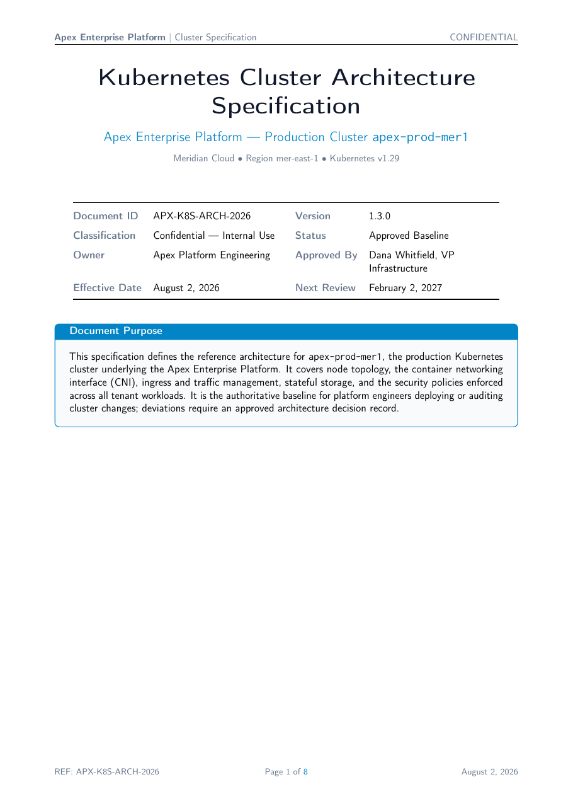

# Kubernetes Cluster Architecture Specification LaTeX Template

[](https://letx.app/templates/tech-docs/kubernetes-cluster-architecture-specification/)
[](LICENSE)

A Kubernetes cluster architecture specification in Lato covering node topology, networking and CNI, ingress and traffic management, stateful storage and security policies.

Edit and compile it in your browser at **[letx.app](https://letx.app/templates/tech-docs/kubernetes-cluster-architecture-specification/)**, with no LaTeX install and real-time collaboration. A compile takes a few seconds.



## What is in it
- Document class: `article` with `11pt, a4paper`
- Compiler: pdflatex
- Files: `main.tex`, `preamble.tex`, and 7 section files under `sections/`

## Use it online
Open **[Kubernetes Cluster Architecture Specification on LetX](https://letx.app/templates/tech-docs/kubernetes-cluster-architecture-specification/)** and click *Open as Template*. It is free.

## <a name="compile"></a>Compile locally
```bash
git clone https://github.com/Shahriar-Labs/latex-templates.git
cd latex-templates/tech-docs/kubernetes-cluster-architecture-specification
latexmk -pdf main.tex
```

## About
Part of the free, open-source [LetX template library](https://letx.app/templates/): technical documentation templates for students, researchers and professionals. Built by [Shahriar Labs](https://shahriarlabs.com).

## License
MIT. See [LICENSE](LICENSE).
