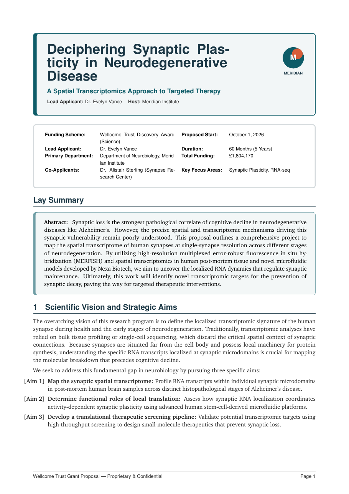

# Wellcome Trust Grant — Free LaTeX Template

[](https://letx.app/templates/grants/wellcome-trust-grant)
[](LICENSE)
[](#compile)

**Wellcome Trust Grant LaTeX template — wellcome trust grant latex. Elegant, compile-tested, editable online at letx.app.**

Edit and compile this template instantly in your browser — no LaTeX install — at **[letx.app](https://letx.app/templates/grants/wellcome-trust-grant)**, with real-time collaboration and one-second compiles.



## Features
- Elegant, modern design
- Compile-tested (pdflatex)
- Fully editable sample content

## Use it online (recommended)
Open **[Wellcome Trust Grant on LetX »](https://letx.app/templates/grants/wellcome-trust-grant)** and click *Open as Template* — it compiles in ~1 second, in your browser, free.

## <a name="compile"></a>Compile locally
```bash
git clone https://github.com/Shahriar-Labs/wellcome-trust-grant.git
cd wellcome-trust-grant
latexmk -pdf main.tex
```
Compiler: **pdflatex** (see `metadata.json`).

## About
Part of the free, open-source [LetX template library](https://letx.app/templates) — grants templates for students, researchers, and professionals. Built by [Shahriar Labs](https://shahriarlabs.com).

## License
MIT — free for personal and commercial use. See [LICENSE](LICENSE).
